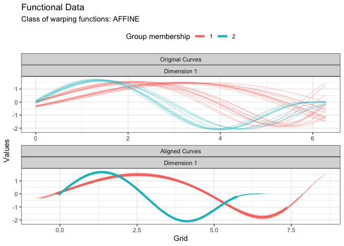
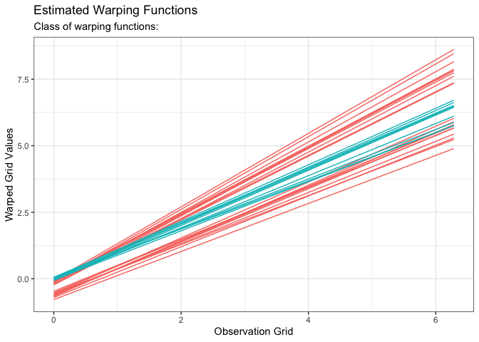

<!-- README.md is generated from README.Rmd. Please edit that file -->

# fdacluster

<!-- badges: start -->

[](https://github.com/astamm/fdacluster/actions)
[](https://github.com/astamm/fdacluster/actions)
[](https://app.codecov.io/gh/astamm/fdacluster)
[](https://github.com/astamm/fdacluster/actions)
[](https://CRAN.R-project.org/package=fdacluster)
<!-- badges: end -->

The [**fdacluster**](https://astamm.github.io/fdacluster/) package
provides the
[`kma()`](https://astamm.github.io/fdacluster/reference/kma.html)
function that jointly performs clustering and alignment of a functional
data set.

## Getting Started

### Prerequisites

The package is linked against OpenMP and the BLAS and LAPACK libraries.
Hence, you will need to set up an appropriate development environment
for the package to install properly. Specifically:

-   on Linux: it should be ready;
-   on Windows: you should install
    [Rtools](https://cran.r-project.org/bin/windows/Rtools/rtools40.html);
-   on macOS: you should refer to <https://mac.r-project.org/tools/> and
    install the relevant tools.

### Installation

You can install the latest stable version of
[**fdacluster**](https://astamm.github.io/fdacluster/) from CRAN with:

``` r
install.packages("fdacluster")
```

Or you can install the development version from
[GitHub](https://github.com/astamm/fdacluster) with:

``` r
# install.packages("remotes")
remotes::install_github("astamm/fdacluster")
```

## Example

``` r
library(fdacluster)

res <- kma(
  simulated30$x,
  simulated30$y,
  seeds = c(1, 21),
  n_clust = 2,
  center_method = "medoid",
  warping_method = "affine",
  dissimilarity_method = "pearson"
)
#> Information about the data set:
#>  - Number of observations: 30
#>  - Number of dimensions: 1
#>  - Number of points: 200
#> 
#> Information about cluster initialization:
#>  - Number of clusters: 2
#>  - Initial seeds for cluster centers:          1        21
#> 
#> Information about the methods used within the algorithm:
#>  - Warping method: affine
#>  - Center method: medoid
#>  - Dissimilarity method: pearson
#>  - Optimization method: bobyqa
#> 
#> Information about warping parameter bounds:
#>  - Warping options:    0.1500   0.1500
#> 
#> Information about convergence criteria:
#>  - Maximum number of iterations: 100
#>  - Distance relative tolerance: 0.001
#> 
#> Information about parallelization setup:
#>  - Number of threads: 1
#>  - Parallel method: 0
#> 
#> Other information:
#>  - Use fence to robustify: 0
#>  - Check total dissimilarity: 1
#>  - Compute overall center: 0
#> 
#> Running k-centroid algorithm:
#>  - Iteration #1
#>    * Size of cluster #0: 20
#>    * Size of cluster #1: 10
#>  - Iteration #2
#>    * Size of cluster #0: 20
#>    * Size of cluster #1: 10
#> 
#> Active stopping criteria:
#>  - Memberships did not change.

plot(res, type = "data")
```



``` r
plot(res, type = "warping")
```


