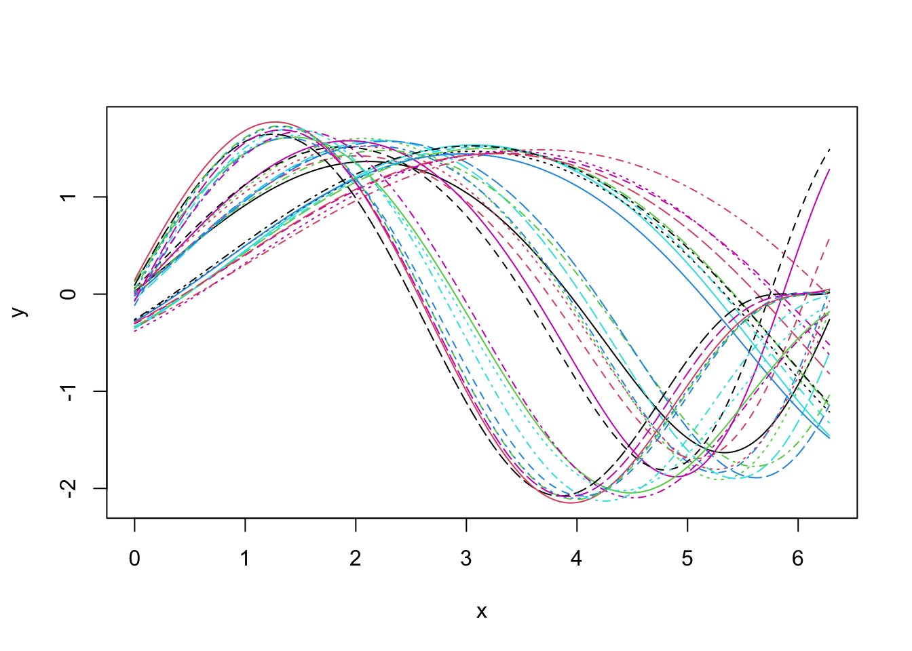
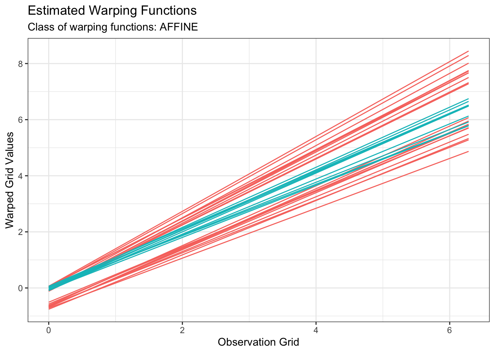

<!-- README.md is generated from README.Rmd. Please edit that file -->

# fdacluster 

<!-- badges: start -->

[](https://github.com/astamm/fdacluster/actions)
[](https://github.com/astamm/fdacluster/actions)
[](https://app.codecov.io/gh/astamm/fdacluster)
[](https://github.com/astamm/fdacluster/actions)
[](https://CRAN.R-project.org/package=fdacluster)
<!-- badges: end -->

The [**fdacluster**](https://astamm.github.io/fdacluster/) package
provides implementations of the $k$-means, hierarchical agglomerative
and DBSCAN clustering methods for functional data. Variability in
functional data is intrinsically divided into three components:
*amplitude*, *phase* and *ancillary* variability. The first two sources
of variability can be captured with a dedicated statistical analysis
that integrates a *curve alignment* step. The $k$-means and HAC
algorithms implemented in
[**fdacluster**](https://astamm.github.io/fdacluster/) provide
clustering structures that are based either on ampltitude variation
(default behavior) or phase variation. This is achieved by jointly
performing clustering and alignment of a functional data set. The three
main related functions are
[`fdakmeans()`](https://astamm.github.io/fdacluster/reference/fdakmeans.html)
for the $k$-means,
[`fdahclust()`](https://astamm.github.io/fdacluster/reference/fdahclust.html)
for HAC and
[`fdadbscan()`](https://astamm.github.io/fdacluster/reference/fdadbscan.html)
for DBSCAN. The methods handle **multivariate codomains**.

## Installation

You can install the official version from CRAN via:

``` r
install.packages("fdacluster")
```

or you can opt to install the development version from
[GitHub](https://github.com/) with:

``` r
# install.packages("remotes")
remotes::install_github("astamm/fdacluster")
```

## Example

### Data set

Let us consider the following simulated example of $30$ $1$-dimensional
curves: 

Looking at the data set, it seems that we shall expect $3$ groups if we
aim at clustering based on phase variability but probably only $2$
groups if we search for a clustering structure based on amplitude
variability.

### $k$-means based on amplitude variability

We can perform $k$-means clustering based on amplitude variability as
follows:

``` r
out1 <- fdakmeans(
  simulated30$x,
  simulated30$y,
  seeds = c(1, 21),
  n_clusters = 2,
  centroid_type = "mean",
  warping_class = "affine",
  metric = "pearson", 
  cluster_on_phase = FALSE
)
#> Information about the data set:
#>  - Number of observations: 30
#>  - Number of dimensions: 1
#>  - Number of points: 200
#> 
#> Information about cluster initialization:
#>  - Number of clusters: 2
#>  - Initial seeds for cluster centers:          1        21
#> 
#> Information about the methods used within the algorithm:
#>  - Warping method: affine
#>  - Center method: mean
#>  - Dissimilarity method: pearson
#>  - Optimization method: bobyqa
#> 
#> Information about warping parameter bounds:
#>  - Warping options:    0.1500   0.1500
#> 
#> Information about convergence criteria:
#>  - Maximum number of iterations: 100
#>  - Distance relative tolerance: 0.001
#> 
#> Information about parallelization setup:
#>  - Number of threads: 1
#>  - Parallel method: 0
#> 
#> Other information:
#>  - Use fence to robustify: 0
#>  - Check total dissimilarity: 1
#>  - Compute overall center: 0
#> 
#> Running k-centroid algorithm:
#>  - Iteration #1
#>    * Size of cluster #0: 20
#>    * Size of cluster #1: 10
#>  - Iteration #2
#>    * Size of cluster #0: 20
#>    * Size of cluster #1: 10
#> 
#> Active stopping criteria:
#>  - Memberships did not change.
```

All of
[`fdakmeans()`](https://astamm.github.io/fdacluster/reference/fdakmeans.html),
[`fdahclust()`](https://astamm.github.io/fdacluster/reference/fdahclust.html)
and
[`fdadbscan()`](https://astamm.github.io/fdacluster/reference/fdadbscan.html)
functions returns an object of class
[`caps`](https://astamm.github.io/fdacluster/reference/caps.html) (for
**C**lustering with **A**mplitude and **P**hase **S**eparation) for
which `S3` specialized methods of
[`ggplot2::autoplot()`](https://astamm.github.io/fdacluster/reference/autoplot.caps.html)
and
[`graphics::plot()`](https://astamm.github.io/fdacluster/reference/plot.caps.html)
have been implemented. Therefore, we can visualize the results simply
with:

``` r
plot(out1, type = "amplitude")
```


``` r
plot(out1, type = "phase")
```



### $k$-means based on phase variability

We can perform $k$-means clustering based on phase variability only by
switch the `cluster_on_phase` argument to `TRUE`:

``` r
out2 <- fdakmeans(
  simulated30$x,
  simulated30$y,
  seeds = c(1, 11, 21),
  n_clusters = 3,
  centroid_type = "mean",
  warping_class = "affine",
  metric = "pearson", 
  cluster_on_phase = TRUE
)
#> Information about the data set:
#>  - Number of observations: 30
#>  - Number of dimensions: 1
#>  - Number of points: 200
#> 
#> Information about cluster initialization:
#>  - Number of clusters: 3
#>  - Initial seeds for cluster centers:          1        11        21
#> 
#> Information about the methods used within the algorithm:
#>  - Warping method: affine
#>  - Center method: mean
#>  - Dissimilarity method: pearson
#>  - Optimization method: bobyqa
#> 
#> Information about warping parameter bounds:
#>  - Warping options:    0.1500   0.1500
#> 
#> Information about convergence criteria:
#>  - Maximum number of iterations: 100
#>  - Distance relative tolerance: 0.001
#> 
#> Information about parallelization setup:
#>  - Number of threads: 1
#>  - Parallel method: 0
#> 
#> Other information:
#>  - Use fence to robustify: 0
#>  - Check total dissimilarity: 1
#>  - Compute overall center: 0
#> 
#> Running k-centroid algorithm:
#>  - Iteration #1
#>    * Size of cluster #0: 10
#>    * Size of cluster #1: 10
#>    * Size of cluster #2: 10
#>  - Iteration #2
#>    * Size of cluster #0: 10
#>    * Size of cluster #1: 10
#>    * Size of cluster #2: 10
#> 
#> Active stopping criteria:
#>  - Memberships did not change.
```

We can inspect the result:

``` r
plot(out2, type = "amplitude")
```


``` r
plot(out2, type = "phase")
```


We can perform similar analyses using HAC or DBSCAN instead of
$k$-means. The [**fdacluster**](https://astamm.github.io/fdacluster/)
package also provides visualization tools to help choosing the optimal
number of cluster based on WSS and silhouette values. This can be
achieved by using a combination of the functions
[`compare_caps()`](https://astamm.github.io/fdacluster/reference/compare_caps.html)
and
[`plot.mcaps()`](https://astamm.github.io/fdacluster/reference/plot.mcaps.html).
