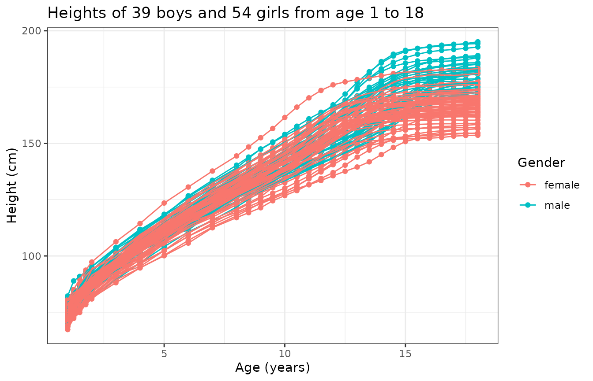
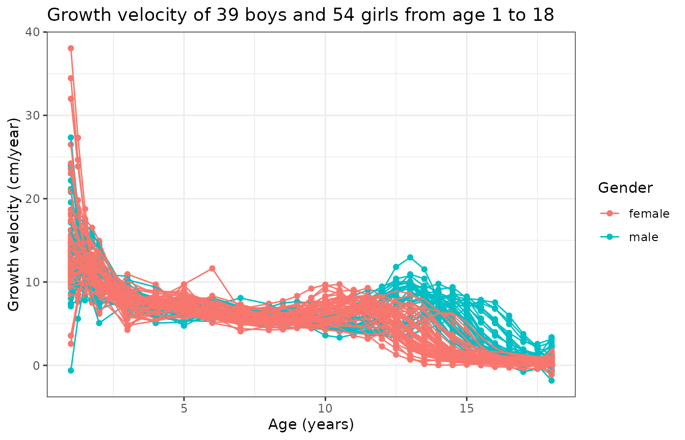
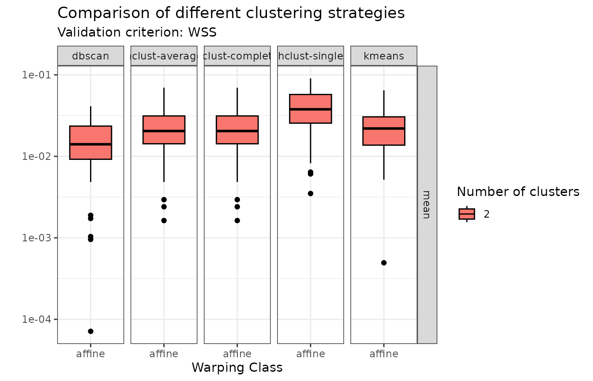
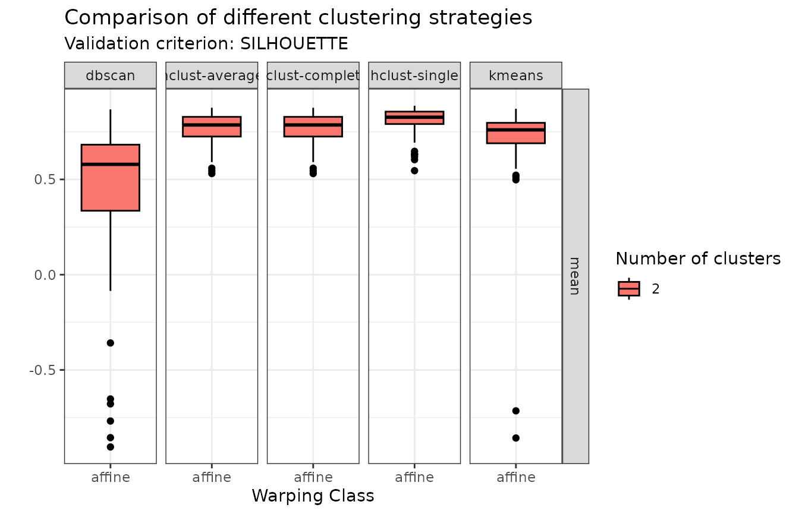
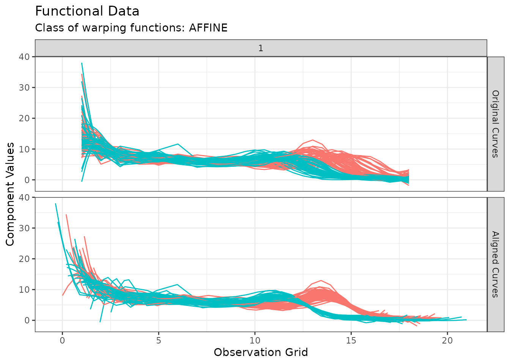
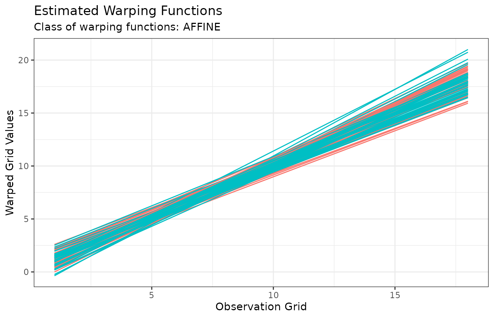
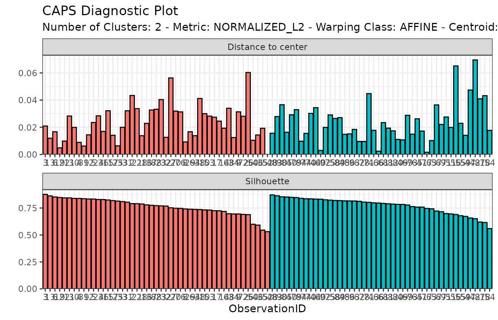

# Analysis of Berkeley growth data

## The Berkeley growth data

A total of 93 children (39 boys and 54 girls) have been followed on
which the height in cm has been measured over time on a common grid of
age:

``` r
mb <- as.factor(c(
  rep("male", dim(growth$hgtm)[2]),
  rep("female", dim(growth$hgtf)[2])
))
```

``` r
N <- length(mb)
x <- growth$age
M <- length(x)
y0 <- cbind(growth$hgtm, growth$hgtf)
tibble::tibble(
  Age = replicate(N, x, simplify = FALSE),
  Height = matrix_tree(y0, margin = 2),
  Gender = mb,
  CurveID = 1:N
) |>
  unnest(Age, Height) |>
  ggplot(aes(Age, Height, color = Gender, group = CurveID)) +
  geom_point() +
  geom_line() +
  theme_bw() +
  labs(
    title = "Heights of 39 boys and 54 girls from age 1 to 18",
    x = "Age (years)",
    y = "Height (cm)"
  )
```



A single observation is actually a time series
$\mathbf{x}_{i} = \left( x_{i}\left( t_{1} \right),\ldots,x_{i}\left( t_{M} \right) \right)^{\top}$.
We can hypothesize that we know what happened between any two
consecutive points $t_{j}$ and $t_{j + 1}$ even though we did not
observe the data in $\left( t_{j},t_{j + 1} \right)$. This is usually
achieved via splines or Fourier or wavelet basis decomposition to confer
the observation with some degree of regularity and to account for
possible periodicity or other specificity of the data point. This step
of *data representation* effectively transforms the original observation
$\mathbf{x}_{i}$ which was a time series into a functional data point
$\left. x_{i}:\mathcal{D}\rightarrow\mathcal{M} \right.$.

## Functional data representation

Given an orthonormal basis $\{ e_{b}\}_{b \geq 1}$ of the functional
space which observations are assumed to belong to, we can model
observation $x_{i}$ as:

$$x_{i} = f_{i} + \varepsilon_{i},$$ where:
$$f_{i}(t) = \sum\limits_{b = 1}^{B}f_{ib}e_{b}(t),$$ for some
truncation $B$. The coefficients $f_{ib}$ are then adjusted by
minimizing a cost function that usually includes the data attachment
term and a rougness penalty term as a way to enforce some regularity
into the functional representation. It is common to use for instance the
norm of the second derivative as roughness penalty, in which case the
cost function becomes:

$$\sum\limits_{m = 1}^{M}\left( x_{i}\left( t_{m} \right) - f_{i}\left( t_{m} \right) \right)^{2} + \lambda\sum\limits_{m = 1}^{M}\left\lbrack f_{i}^{(2)}\left( t_{m} \right) \right\rbrack^{2}$$

In practice, such a functional representation can be achieved in R using
the **fda** package. The following code adjusts a B-spline
representation to the growth curves where the weight $\lambda$ of the
roughness penalty is determined by minimizing the generalized
cross-validation criterion:

``` r
basisobj <- fda::create.bspline.basis(rangeval = range(x), nbasis = 15)
fd_vals <- lapply(1:N, \(n) {
  yobs <- y0[, n]
  result <- fda::smooth.basis(x, yobs, basisobj)
  yfd <- result$fd
  cost <- function(lam) {
    yfdPar <- fda::fdPar(yfd, 2, lam)
    out <- fda::smooth.basis(x, yobs, yfdPar)
    out$gcv
  }
  lambda_opt <- stats::optimise(cost, c(1e-8, 1))$minimum
  if (lambda_opt <= 1e-8) {
    cli::cli_alert_warning(
      "The optimal penalty has reached the lower bound (1e-8) for curve #{n}."
    )
  }
  if (lambda_opt >= 1) {
    cli::cli_alert_warning(
      "The optimal penalty has reached the upper bound (1) for curve #{n}."
    )
  }
  yfdPar <- fda::fdPar(yfd, 2, lambda_opt)
  fda::smooth.fd(yfd, yfdPar)
})
fd <- fda::fd(
  coef = fd_vals |>
    lapply(\(.x) .x$coefs) |>
    do.call(cbind, args = _),
  basisobj = basisobj
)
```

We can now take a look of the data under this representation:

``` r
y0 <- fda::eval.fd(x, fd, 0)
tibble::tibble(
  Age = replicate(N, x, simplify = FALSE),
  Height = matrix_tree(y0, margin = 2),
  Gender = mb,
  CurveID = 1:N
) |>
  unnest(Age, Height) |>
  ggplot(aes(Age, Height, color = Gender, group = CurveID)) +
  geom_point() +
  geom_line() +
  theme_bw() +
  labs(
    title = "Heights of 39 boys and 54 girls from age 1 to 18",
    x = "Age (years)",
    y = "Height (cm)"
  )
```


We can also compute and display the growth rate:

``` r
y1 <- fda::eval.fd(x, fd, 1)
tibble::tibble(
  Age = replicate(N, x, simplify = FALSE),
  Height = matrix_tree(y1, margin = 2),
  Gender = mb,
  CurveID = 1:N
) |>
  unnest(Age, Height) |>
  ggplot(aes(Age, Height, color = Gender, group = CurveID)) +
  geom_point() +
  geom_line() +
  theme_bw() +
  labs(
    title = "Growth velocity of 39 boys and 54 girls from age 1 to 18",
    x = "Age (years)",
    y = "Growth velocity (cm/year)"
  )
```



This graph is interesting because it tells us that

- there is a first peak of growth velocity common to boys and girls
  early in age, just after birth;
- there is a second peak of growth velocity corresponding to puberty
  that happens earlier for girls;
- the variability of this second peak is due to gender and also
  inter-subject variability.

In particular, if one wanted to perform clustering of these curves to
label boys and girls (assuming we did not have such an information),
then the above figures show that the best chance we have to accomplish
such a clustering is by performing a joint alignment and clustering of
the growth velocity curves so that we can simultaneously (i) minimize
within-group phase variability and (ii) cluster curves based on that
same phase variability.

## Clustering

Initial visualization and data representation steps have revealed that,
if one aims at clustering individuals based on gender, then (s)he should
focus on:

- searching for 2 clusters;
- using the growth velocity curves instead of the growth curves
  themselves;
- cluster based on phase variability;
- perform intra-cluster alignment to separate amplitude and phase
  variability.

However, we still have several possible clustering methods that we can
explore to perform such a task. Namely,
[**fdacluster**](https://astamm.github.io/fdacluster/index.html)
implements the $k$-means algorithm as well as hierarchical clustering
and DBSCAN. We can compare these different clustering strategies:

``` r
growth_mcaps <- compare_caps(
  x = x,
  y = t(y1),
  n_clusters = 2,
  metric = "normalized_l2",
  clustering_method = c(
    "kmeans",
    "hclust-complete",
    "hclust-average",
    "hclust-single",
    "dbscan"
  ),
  warping_class = "affine",
  centroid_type = "mean",
  cluster_on_phase = TRUE
)
```

This generates an object of class
[`mcaps`](https://astamm.github.io/fdacluster/reference/compare_caps.html)
which has specialized `S3` methods for both
[`graphics::plot()`](https://astamm.github.io/fdacluster/reference/plot.mcaps.html)
and
[`ggplot2::autoplot()`](https://astamm.github.io/fdacluster/reference/autoplot.mcaps.html).
When called on an object of class `mcaps`, these methods gain the
optional arguments:

- `validation_criterion` to choose which validation criterion to display
  between distance-to-center (`validation_criterion = "wss"`) and
  silhouette values (`validation_criterion = "silhouette"`);
- `what` to choose whether only the mean criterion should be displayed
  (`what = "mean"`) or the entire distribution across observation in the
  form of a boxplot (`what = "distribution"`).

``` r
plot(growth_mcaps, validation_criterion = "wss", what = "distribution")
```



In terms of within-cluster distances to center (WSS), hierarchical
agglomerative clustering with average or complete linkage and $k$-means
stand out.

``` r
plot(growth_mcaps, validation_criterion = "silhouette", what = "distribution")
```



In terms of individual silhouette values, DBSCAN does not appear in the
comparison because it auto-detects the number of clusters and only found
1 cluster. Of the other methods, hierarchical agglomerative clustering
with average or complete linkage stand out.

We can therefore proceed with hierarchical agglomerative clustering with
complete linkage for example:

``` r
growth_caps <- fdahclust(
  x = x,
  y = t(y1),
  n_clusters = 2,
  metric = "normalized_l2",
  warping_class = "affine",
  centroid_type = "mean",
  cluster_on_phase = TRUE
)
```

This generates an object of class
[`caps`](https://astamm.github.io/fdacluster/reference/caps.html) which
has specialized `S3` methods for both
[`graphics::plot()`](https://astamm.github.io/fdacluster/reference/plot.caps.html)
and
[`ggplot2::autoplot()`](https://astamm.github.io/fdacluster/reference/autoplot.caps.html).
When called on an object of class
[`caps`](https://astamm.github.io/fdacluster/reference/caps.html), these
methods gain the optional argument `type` which can be one of
`amplitude` or `phase`.

The default is `type = "amplitude"` in which case curves before and
after alignment are shown and colored by cluster membership:

``` r
plot(growth_caps, type = "amplitude")
#> Warning in data.frame(grid = as.vector(grids), value = as.vector(unicurves), :
#> row names were found from a short variable and have been discarded
#> Warning in data.frame(grid = as.vector(grids), value = as.vector(unicurves), :
#> row names were found from a short variable and have been discarded
```



When `type = "phase"`, the warping functions are instead displayed which
gives a sense of the phase variability in the data *after* phase
alignment. Again, they are colored by cluster membership:

``` r
plot(growth_caps, type = "phase")
#> Warning in data.frame(grid = as.vector(x$original_grids), value =
#> as.vector(x$aligned_grids), : row names were found from a short variable and
#> have been discarded
```



It is also possible to show a visual inspection of internal cluster
validation via the
[`diagnostic_plot()`](https://astamm.github.io/fdacluster/reference/diagnostic_plot.html)
function, which shows individual distance-to-center and silhouette
values, with observations ordered by decreasing value of intra-cluster
silhouette:

``` r
diagnostic_plot(growth_caps)
```



Finally, we can explore the correspondence between the non-supervised
groups that we found and the actual gender distribution:

``` r
table(growth_caps$memberships, mb) |>
  `rownames<-`(c("Group 1", "Group 2")) |>
  knitr::kable()
```

|         | female | male |
|:--------|-------:|-----:|
| Group 1 |      9 |   38 |
| Group 2 |     45 |    1 |

The second group is almost entirely composed of girls while the first
group is mainly composed of men although 23.68% of girls are present in
that group. It could be interesting to dig more into the other
characteristics of these girls which might explain why our clustering
*sees them* as boys as well as understanding why 1 boy is seen as a
girl.
